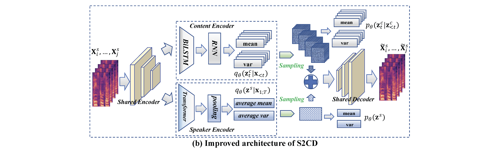

# Abstract

In this paper, we propose a **S**elf-heuristic **S**peaker **C**ontent **D**isentanglement (S2CD) model for *any_to_any* voice conversion without using any external resources, e.g., speaker labels or vectors, linguistic models, and transcriptions. S2CD is built on the disentanglement sequential variational autoencoder (DSVAE), but improves DSVAE structure at the model architecture level from three perspectives. Specifically, we develop different structures for speaker and content encoders based on their underlying static/dynamic property. We further propose a generative graph, modelled by S2CD, so as to make S2CD well mimic the multi-speaker speech generation process. Finally, we propose a self-heuristic way to introduce bias to the prior modelling. Extensive empirical evaluations show the effectiveness of S2CD for *any_to_any* voice conversion.

# Audio Samples

We present audio samples generated by the baseline models and our proposed model.

## Target Singers

The following audio samples are from the target female and male singers.

| Target | Samples |
|  ----  | ----  |
| Female | <audio id="audio" controls="" preload="none" style="width: 250px;"> <source id="wav" src="audios/BB/gt/BB006F24I016.wav"></audio> <audio id="audio" controls="" preload="none" style="width: 250px;"> <source id="wav" src="audios/BB/gt/BB009F24I024.wav"></audio> |
| Male | <audio id="audio" controls="" preload="none" style="width: 250px;"> <source id="wav" src="audios/AM2/gt/0003_048-03.wav"></audio> <audio id="audio" controls="" preload="none" style="width: 250px;"> <source id="wav" src="audios/AM2/gt/0006_041-08.wav"></audio> |

## Source Samples

3 female singing audio and 3 male singing audio are presented as the source samples. The samples are from different singers.

| | Samples |
| --- | --- |
| F1 | <audio id="audio" controls="" preload="none" style="height: 40px"> <source id="wav" src="audios/source/F_CDF008_XT_097_023-02.wav"></audio> |
| F2 | <audio id="audio" controls="" preload="none" style="height: 40px"> <source id="wav" src="audios/source/F_F007_WXR_011_026-01.wav"></audio> |
| F3 | <audio id="audio" controls="" preload="none" style="height: 40px"> <source id="wav" src="audios/source/F_F008_ZYF_008_009-00.wav"></audio> |
| M1 | <audio id="audio" controls="" preload="none" style="height: 40px"> <source id="wav" src="audios/source/M_CDM008_GG_99_032-02.wav"></audio> |
| M2 | <audio id="audio" controls="" preload="none" style="height: 40px"> <source id="wav" src="audios/source/M_M003_CYC_018_020-02.wav"></audio> |
| M3 | <audio id="audio" controls="" preload="none" style="height: 40px"> <source id="wav" src="audios/source/M_M005_S_013_023-06.wav"></audio> |

## Converted Samples

<!-- * **M1:** BASE1
* **M2:** BASE2
* **M3:** BASE3
* **M4:** BASE3 + ME
* **M5:** BASE3 + ME + SC
* **M6:** BASE3 + ME + SC + MS **\(our proposed model\)** -->

#### Target Female

| | F1 | F2 | F3 | M1 | M2 | M3 |
| --- | --- | --- | --- | --- | --- | --- |
| BASE1 | <audio id="audio" controls="" preload="none" style="width: 140px;height: 50px"> <source id="wav" src="audios/BB/m1/F_CDF008_XT_097_023-02.wav"></audio> | <audio id="audio" controls="" preload="none" style="width: 140px;height: 50px"> <source id="wav" src="audios/BB/m1/F_F007_WXR_011_026-01.wav"></audio> | <audio id="audio" controls="" preload="none" style="width: 140px;height: 50px"> <source id="wav" src="audios/BB/m1/F_F008_ZYF_008_009-00.wav"></audio> | <audio id="audio" controls="" preload="none" style="width: 140px;height: 50px"> <source id="wav" src="audios/BB/m1/M_CDM008_GG_99_032-02.wav"></audio> | <audio id="audio" controls="" preload="none" style="width: 140px;height: 50px"> <source id="wav" src="audios/BB/m1/M_M003_CYC_018_020-02.wav"></audio> | <audio id="audio" controls="" preload="none" style="width: 140px;height: 50px"> <source id="wav" src="audios/BB/m1/M_M005_S_013_023-06.wav"></audio> |
| BASE2 | <audio id="audio" controls="" preload="none" style="width: 140px;height: 50px"> <source id="wav" src="audios/BB/m2/F_CDF008_XT_097_023-02.wav"></audio> | <audio id="audio" controls="" preload="none" style="width: 140px;height: 50px"> <source id="wav" src="audios/BB/m2/F_F007_WXR_011_026-01.wav"></audio> | <audio id="audio" controls="" preload="none" style="width: 140px;height: 50px"> <source id="wav" src="audios/BB/m2/F_F008_ZYF_008_009-00.wav"></audio> | <audio id="audio" controls="" preload="none" style="width: 140px;height: 50px"> <source id="wav" src="audios/BB/m2/M_CDM008_GG_99_032-02.wav"></audio> | <audio id="audio" controls="" preload="none" style="width: 140px;height: 50px"> <source id="wav" src="audios/BB/m2/M_M003_CYC_018_020-02.wav"></audio> | <audio id="audio" controls="" preload="none" style="width: 140px;height: 50px"> <source id="wav" src="audios/BB/m2/M_M005_S_013_023-06.wav"></audio> |
| BASE3 | <audio id="audio" controls="" preload="none" style="width: 140px;height: 50px"> <source id="wav" src="audios/BB/m3/F_CDF008_XT_097_023-02_F_CDF008_XT_097_023-02.npy.wav"></audio> | <audio id="audio" controls="" preload="none" style="width: 140px;height: 50px"> <source id="wav" src="audios/BB/m3/F_F007_WXR_011_026-01_F_F007_WXR_011_026-01.npy.wav"></audio> | <audio id="audio" controls="" preload="none" style="width: 140px;height: 50px"> <source id="wav" src="audios/BB/m3/F_F008_ZYF_008_009-00_F_F008_ZYF_008_009-00.npy.wav"></audio> | <audio id="audio" controls="" preload="none" style="width: 140px;height: 50px"> <source id="wav" src="audios/BB/m3/M_CDM008_GG_99_032-02_M_CDM008_GG_99_032-02.npy.wav"></audio> | <audio id="audio" controls="" preload="none" style="width: 140px;height: 50px"> <source id="wav" src="audios/BB/m3/M_M003_CYC_018_020-02_M_M003_CYC_018_020-02.npy.wav"></audio> | <audio id="audio" controls="" preload="none" style="width: 140px;height: 50px"> <source id="wav" src="audios/BB/m3/M_M005_S_013_023-06_M_M005_S_013_023-06.npy.wav"></audio> |
| **Proposed** | <audio id="audio" controls="" preload="none" style="width: 140px;height: 50px"> <source id="wav" src="audios/BB/m6/F_CDF008_XT_097_023-02_F_CDF008_XT_097_023-02.npy.wav"></audio> | <audio id="audio" controls="" preload="none" style="width: 140px;height: 50px"> <source id="wav" src="audios/BB/m6/F_F007_WXR_011_026-01_F_F007_WXR_011_026-01.npy.wav"></audio> | <audio id="audio" controls="" preload="none" style="width: 140px;height: 50px"> <source id="wav" src="audios/BB/m6/F_F008_ZYF_008_009-00_F_F008_ZYF_008_009-00.npy.wav"></audio> | <audio id="audio" controls="" preload="none" style="width: 140px;height: 50px"> <source id="wav" src="audios/BB/m6/M_CDM008_GG_99_032-02_M_CDM008_GG_99_032-02.npy.wav"></audio> | <audio id="audio" controls="" preload="none" style="width: 140px;height: 50px"> <source id="wav" src="audios/BB/m6/M_M003_CYC_018_020-02_M_M003_CYC_018_020-02.npy.wav"></audio> | <audio id="audio" controls="" preload="none" style="width: 140px;height: 50px"> <source id="wav" src="audios/BB/m6/M_M005_S_013_023-06_M_M005_S_013_023-06.npy.wav"></audio> |

#### Target Male

| | F1 | F2 | F3 | M1 | M2 | M3 |
| --- | --- | --- | --- | --- | --- | --- |
| BASE1 | <audio id="audio" controls="" preload="none" style="width: 140px;height: 50px"> <source id="wav" src="audios/AM2/m1/F_CDF008_XT_097_023-02.wav"></audio> | <audio id="audio" controls="" preload="none" style="width: 140px;height: 50px"> <source id="wav" src="audios/AM2/m1/F_F007_WXR_011_026-01.wav"></audio> | <audio id="audio" controls="" preload="none" style="width: 140px;height: 50px"> <source id="wav" src="audios/AM2/m1/F_F008_ZYF_008_009-00.wav"></audio> | <audio id="audio" controls="" preload="none" style="width: 140px;height: 50px"> <source id="wav" src="audios/AM2/m1/M_CDM008_GG_99_032-02.wav"></audio> | <audio id="audio" controls="" preload="none" style="width: 140px;height: 50px"> <source id="wav" src="audios/AM2/m1/M_M003_CYC_018_020-02.wav"></audio> | <audio id="audio" controls="" preload="none" style="width: 140px;height: 50px"> <source id="wav" src="audios/AM2/m1/M_M005_S_013_023-06.wav"></audio> |
| BASE2 | <audio id="audio" controls="" preload="none" style="width: 140px;height: 50px"> <source id="wav" src="audios/AM2/m2/F_CDF008_XT_097_023-02.wav"></audio> | <audio id="audio" controls="" preload="none" style="width: 140px;height: 50px"> <source id="wav" src="audios/AM2/m2/F_F007_WXR_011_026-01.wav"></audio> | <audio id="audio" controls="" preload="none" style="width: 140px;height: 50px"> <source id="wav" src="audios/AM2/m2/F_F008_ZYF_008_009-00.wav"></audio> | <audio id="audio" controls="" preload="none" style="width: 140px;height: 50px"> <source id="wav" src="audios/AM2/m2/M_CDM008_GG_99_032-02.wav"></audio> | <audio id="audio" controls="" preload="none" style="width: 140px;height: 50px"> <source id="wav" src="audios/AM2/m2/M_M003_CYC_018_020-02.wav"></audio> | <audio id="audio" controls="" preload="none" style="width: 140px;height: 50px"> <source id="wav" src="audios/AM2/m2/M_M005_S_013_023-06.wav"></audio> |
| BASE3 | <audio id="audio" controls="" preload="none" style="width: 140px;height: 50px"> <source id="wav" src="audios/AM2/m3/F_CDF008_XT_097_023-02_F_CDF008_XT_097_023-02.npy.wav"></audio> | <audio id="audio" controls="" preload="none" style="width: 140px;height: 50px"> <source id="wav" src="audios/AM2/m3/F_F007_WXR_011_026-01_F_F007_WXR_011_026-01.npy.wav"></audio> | <audio id="audio" controls="" preload="none" style="width: 140px;height: 50px"> <source id="wav" src="audios/AM2/m3/F_F008_ZYF_008_009-00_F_F008_ZYF_008_009-00.npy.wav"></audio> | <audio id="audio" controls="" preload="none" style="width: 140px;height: 50px"> <source id="wav" src="audios/AM2/m3/M_CDM008_GG_99_032-02_M_CDM008_GG_99_032-02.npy.wav"></audio> | <audio id="audio" controls="" preload="none" style="width: 140px;height: 50px"> <source id="wav" src="audios/AM2/m3/M_M003_CYC_018_020-02_M_M003_CYC_018_020-02.npy.wav"></audio> | <audio id="audio" controls="" preload="none" style="width: 140px;height: 50px"> <source id="wav" src="audios/AM2/m3/M_M005_S_013_023-06_M_M005_S_013_023-06.npy.wav"></audio> |
| **Proposed** | <audio id="audio" controls="" preload="none" style="width: 140px;height: 50px"> <source id="wav" src="audios/AM2/m6/F_CDF008_XT_097_023-02_F_CDF008_XT_097_023-02.npy.wav"></audio> | <audio id="audio" controls="" preload="none" style="width: 140px;height: 50px"> <source id="wav" src="audios/AM2/m6/F_F007_WXR_011_026-01_F_F007_WXR_011_026-01.npy.wav"></audio> | <audio id="audio" controls="" preload="none" style="width: 140px;height: 50px"> <source id="wav" src="audios/AM2/m6/F_F008_ZYF_008_009-00_F_F008_ZYF_008_009-00.npy.wav"></audio> | <audio id="audio" controls="" preload="none" style="width: 140px;height: 50px"> <source id="wav" src="audios/AM2/m6/M_CDM008_GG_99_032-02_M_CDM008_GG_99_032-02.npy.wav"></audio> | <audio id="audio" controls="" preload="none" style="width: 140px;height: 50px"> <source id="wav" src="audios/AM2/m6/M_M003_CYC_018_020-02_M_M003_CYC_018_020-02.npy.wav"></audio> | <audio id="audio" controls="" preload="none" style="width: 140px;height: 50px"> <source id="wav" src="audios/AM2/m6/M_M005_S_013_023-06_M_M005_S_013_023-06.npy.wav"></audio> |

## Ablation Tests

#### Target Female

| | F1 | F2 | M1 | M2 |
| --- | --- | --- | --- | --- |
| BASE3 | <audio id="audio" controls="" preload="none" style="width: 140px;height: 50px"> <source id="wav" src="audios/BB/m3/F_CDF008_XT_097_023-02_F_CDF008_XT_097_023-02.npy.wav"></audio> | <audio id="audio" controls="" preload="none" style="width: 140px;height: 50px"> <source id="wav" src="audios/BB/m3/F_F007_WXR_011_026-01_F_F007_WXR_011_026-01.npy.wav"></audio> | <audio id="audio" controls="" preload="none" style="width: 140px;height: 50px"> <source id="wav" src="audios/BB/m3/M_CDM008_GG_99_032-02_M_CDM008_GG_99_032-02.npy.wav"></audio> | <audio id="audio" controls="" preload="none" style="width: 140px;height: 50px"> <source id="wav" src="audios/BB/m3/M_M003_CYC_018_020-02_M_M003_CYC_018_020-02.npy.wav"></audio> |
| + ME | <audio id="audio" controls="" preload="none" style="width: 140px;height: 50px"> <source id="wav" src="audios/BB/m4/F_CDF008_XT_097_023-02_F_CDF008_XT_097_023-02.npy.wav"></audio> | <audio id="audio" controls="" preload="none" style="width: 140px;height: 50px"> <source id="wav" src="audios/BB/m4/F_F007_WXR_011_026-01_F_F007_WXR_011_026-01.npy.wav"></audio> | <audio id="audio" controls="" preload="none" style="width: 140px;height: 50px"> <source id="wav" src="audios/BB/m4/M_CDM008_GG_99_032-02_M_CDM008_GG_99_032-02.npy.wav"></audio> | <audio id="audio" controls="" preload="none" style="width: 140px;height: 50px"> <source id="wav" src="audios/BB/m4/M_M003_CYC_018_020-02_M_M003_CYC_018_020-02.npy.wav"></audio> |
| + SC | <audio id="audio" controls="" preload="none" style="width: 140px;height: 50px"> <source id="wav" src="audios/BB/m5/F_CDF008_XT_097_023-02_F_CDF008_XT_097_023-02.npy.wav"></audio> | <audio id="audio" controls="" preload="none" style="width: 140px;height: 50px"> <source id="wav" src="audios/BB/m5/F_F007_WXR_011_026-01_F_F007_WXR_011_026-01.npy.wav"></audio> | <audio id="audio" controls="" preload="none" style="width: 140px;height: 50px"> <source id="wav" src="audios/BB/m5/M_CDM008_GG_99_032-02_M_CDM008_GG_99_032-02.npy.wav"></audio> | <audio id="audio" controls="" preload="none" style="width: 140px;height: 50px"> <source id="wav" src="audios/BB/m5/M_M003_CYC_018_020-02_M_M003_CYC_018_020-02.npy.wav"></audio> |
| + MS **\(Proposed\)** | <audio id="audio" controls="" preload="none" style="width: 140px;height: 50px"> <source id="wav" src="audios/BB/m6/F_CDF008_XT_097_023-02_F_CDF008_XT_097_023-02.npy.wav"></audio> | <audio id="audio" controls="" preload="none" style="width: 140px;height: 50px"> <source id="wav" src="audios/BB/m6/F_F007_WXR_011_026-01_F_F007_WXR_011_026-01.npy.wav"></audio> | <audio id="audio" controls="" preload="none" style="width: 140px;height: 50px"> <source id="wav" src="audios/BB/m6/M_CDM008_GG_99_032-02_M_CDM008_GG_99_032-02.npy.wav"></audio> | <audio id="audio" controls="" preload="none" style="width: 140px;height: 50px"> <source id="wav" src="audios/BB/m6/M_M003_CYC_018_020-02_M_M003_CYC_018_020-02.npy.wav"></audio> |

#### Target Male

| | F1 | F2 | M1 | M2 |
| --- | --- | --- | --- | --- |
| BASE3 | <audio id="audio" controls="" preload="none" style="width: 140px;height: 50px"> <source id="wav" src="audios/AM2/m3/F_CDF008_XT_097_023-02_F_CDF008_XT_097_023-02.npy.wav"></audio> | <audio id="audio" controls="" preload="none" style="width: 140px;height: 50px"> <source id="wav" src="audios/AM2/m3/F_F007_WXR_011_026-01_F_F007_WXR_011_026-01.npy.wav"></audio> | <audio id="audio" controls="" preload="none" style="width: 140px;height: 50px"> <source id="wav" src="audios/AM2/m3/M_CDM008_GG_99_032-02_M_CDM008_GG_99_032-02.npy.wav"></audio> | <audio id="audio" controls="" preload="none" style="width: 140px;height: 50px"> <source id="wav" src="audios/AM2/m3/M_M003_CYC_018_020-02_M_M003_CYC_018_020-02.npy.wav"></audio> |
| + ME | <audio id="audio" controls="" preload="none" style="width: 140px;height: 50px"> <source id="wav" src="audios/AM2/m4/F_CDF008_XT_097_023-02_F_CDF008_XT_097_023-02.npy.wav"></audio> | <audio id="audio" controls="" preload="none" style="width: 140px;height: 50px"> <source id="wav" src="audios/AM2/m4/F_F007_WXR_011_026-01_F_F007_WXR_011_026-01.npy.wav"></audio> | <audio id="audio" controls="" preload="none" style="width: 140px;height: 50px"> <source id="wav" src="audios/AM2/m4/M_CDM008_GG_99_032-02_M_CDM008_GG_99_032-02.npy.wav"></audio> | <audio id="audio" controls="" preload="none" style="width: 140px;height: 50px"> <source id="wav" src="audios/AM2/m4/M_M003_CYC_018_020-02_M_M003_CYC_018_020-02.npy.wav"></audio> |
| + SC | <audio id="audio" controls="" preload="none" style="width: 140px;height: 50px"> <source id="wav" src="audios/AM2/m5/F_CDF008_XT_097_023-02_F_CDF008_XT_097_023-02.npy.wav"></audio> | <audio id="audio" controls="" preload="none" style="width: 140px;height: 50px"> <source id="wav" src="audios/AM2/m5/F_F007_WXR_011_026-01_F_F007_WXR_011_026-01.npy.wav"></audio> | <audio id="audio" controls="" preload="none" style="width: 140px;height: 50px"> <source id="wav" src="audios/AM2/m5/M_CDM008_GG_99_032-02_M_CDM008_GG_99_032-02.npy.wav"></audio> | <audio id="audio" controls="" preload="none" style="width: 140px;height: 50px"> <source id="wav" src="audios/AM2/m5/M_M003_CYC_018_020-02_M_M003_CYC_018_020-02.npy.wav"></audio> |
| + MS **\(Proposed\)** | <audio id="audio" controls="" preload="none" style="width: 140px;height: 50px"> <source id="wav" src="audios/AM2/m6/F_CDF008_XT_097_023-02_F_CDF008_XT_097_023-02.npy.wav"></audio> | <audio id="audio" controls="" preload="none" style="width: 140px;height: 50px"> <source id="wav" src="audios/AM2/m6/F_F007_WXR_011_026-01_F_F007_WXR_011_026-01.npy.wav"></audio> | <audio id="audio" controls="" preload="none" style="width: 140px;height: 50px"> <source id="wav" src="audios/AM2/m6/M_CDM008_GG_99_032-02_M_CDM008_GG_99_032-02.npy.wav"></audio> | <audio id="audio" controls="" preload="none" style="width: 140px;height: 50px"> <source id="wav" src="audios/AM2/m6/M_M003_CYC_018_020-02_M_M003_CYC_018_020-02.npy.wav"></audio> |

## Noise Robustness Tests

#### source SNR = 15.30

| | F1 | F2 | M1 | M2 |
| --- | --- | --- | --- | --- |
| Source | <audio id="audio" controls="" preload="none" style="width: 140px;height: 50px"> <source id="wav" src="audios/source_noise1/F_CDF008_XT_097_023-02.wav"></audio> | <audio id="audio" controls="" preload="none" style="width: 140px;height: 50px"> <source id="wav" src="audios/source_noise1/F_F007_WXR_011_026-01.wav"></audio> | <audio id="audio" controls="" preload="none" style="width: 140px;height: 50px"> <source id="wav" src="audios/source_noise1/M_CDM008_GG_99_032-02.wav"></audio> | <audio id="audio" controls="" preload="none" style="width: 140px;height: 50px"> <source id="wav" src="audios/source_noise1/M_M003_CYC_018_020-02.wav"></audio> |
| Target Female | <audio id="audio" controls="" preload="none" style="width: 140px;height: 50px"> <source id="wav" src="audios/BB/noise1/F_CDF008_XT_097_023-02_F_CDF008_XT_097_023-02.npy.wav"></audio> | <audio id="audio" controls="" preload="none" style="width: 140px;height: 50px"> <source id="wav" src="audios/BB/noise1/F_F007_WXR_011_026-01_F_F007_WXR_011_026-01.npy.wav"></audio> | <audio id="audio" controls="" preload="none" style="width: 140px;height: 50px"> <source id="wav" src="audios/BB/noise1/M_CDM008_GG_99_032-02_M_CDM008_GG_99_032-02.npy.wav"></audio> | <audio id="audio" controls="" preload="none" style="width: 140px;height: 50px"> <source id="wav" src="audios/BB/noise1/M_M003_CYC_018_020-02_M_M003_CYC_018_020-02.npy.wav"></audio> |
| Target Male | <audio id="audio" controls="" preload="none" style="width: 140px;height: 50px"> <source id="wav" src="audios/AM2/noise1/F_CDF008_XT_097_023-02_F_CDF008_XT_097_023-02.npy.wav"></audio> | <audio id="audio" controls="" preload="none" style="width: 140px;height: 50px"> <source id="wav" src="audios/AM2/noise1/F_F007_WXR_011_026-01_F_F007_WXR_011_026-01.npy.wav"></audio> | <audio id="audio" controls="" preload="none" style="width: 140px;height: 50px"> <source id="wav" src="audios/AM2/noise1/M_CDM008_GG_99_032-02_M_CDM008_GG_99_032-02.npy.wav"></audio> | <audio id="audio" controls="" preload="none" style="width: 140px;height: 50px"> <source id="wav" src="audios/AM2/noise1/M_M003_CYC_018_020-02_M_M003_CYC_018_020-02.npy.wav"></audio> |

#### source SNR = 8.18

| | F1 | F2 | M1 | M2 |
| --- | --- | --- | --- | --- |
| Source | <audio id="audio" controls="" preload="none" style="width: 140px;height: 50px"> <source id="wav" src="audios/source_noise2/F_CDF008_XT_097_023-02.wav"></audio> | <audio id="audio" controls="" preload="none" style="width: 140px;height: 50px"> <source id="wav" src="audios/source_noise2/F_F007_WXR_011_026-01.wav"></audio> | <audio id="audio" controls="" preload="none" style="width: 140px;height: 50px"> <source id="wav" src="audios/source_noise2/M_CDM008_GG_99_032-02.wav"></audio> | <audio id="audio" controls="" preload="none" style="width: 140px;height: 50px"> <source id="wav" src="audios/source_noise2/M_M003_CYC_018_020-02.wav"></audio> |
| Target Female | <audio id="audio" controls="" preload="none" style="width: 140px;height: 50px"> <source id="wav" src="audios/BB/noise2/F_CDF008_XT_097_023-02_F_CDF008_XT_097_023-02.npy.wav"></audio> | <audio id="audio" controls="" preload="none" style="width: 140px;height: 50px"> <source id="wav" src="audios/BB/noise2/F_F007_WXR_011_026-01_F_F007_WXR_011_026-01.npy.wav"></audio> | <audio id="audio" controls="" preload="none" style="width: 140px;height: 50px"> <source id="wav" src="audios/BB/noise2/M_CDM008_GG_99_032-02_M_CDM008_GG_99_032-02.npy.wav"></audio> | <audio id="audio" controls="" preload="none" style="width: 140px;height: 50px"> <source id="wav" src="audios/BB/noise2/M_M003_CYC_018_020-02_M_M003_CYC_018_020-02.npy.wav"></audio> |
| Target Male | <audio id="audio" controls="" preload="none" style="width: 140px;height: 50px"> <source id="wav" src="audios/AM2/noise2/F_CDF008_XT_097_023-02_F_CDF008_XT_097_023-02.npy.wav"></audio> | <audio id="audio" controls="" preload="none" style="width: 140px;height: 50px"> <source id="wav" src="audios/AM2/noise2/F_F007_WXR_011_026-01_F_F007_WXR_011_026-01.npy.wav"></audio> | <audio id="audio" controls="" preload="none" style="width: 140px;height: 50px"> <source id="wav" src="audios/AM2/noise2/M_CDM008_GG_99_032-02_M_CDM008_GG_99_032-02.npy.wav"></audio> | <audio id="audio" controls="" preload="none" style="width: 140px;height: 50px"> <source id="wav" src="audios/AM2/noise2/M_M003_CYC_018_020-02_M_M003_CYC_018_020-02.npy.wav"></audio> |

